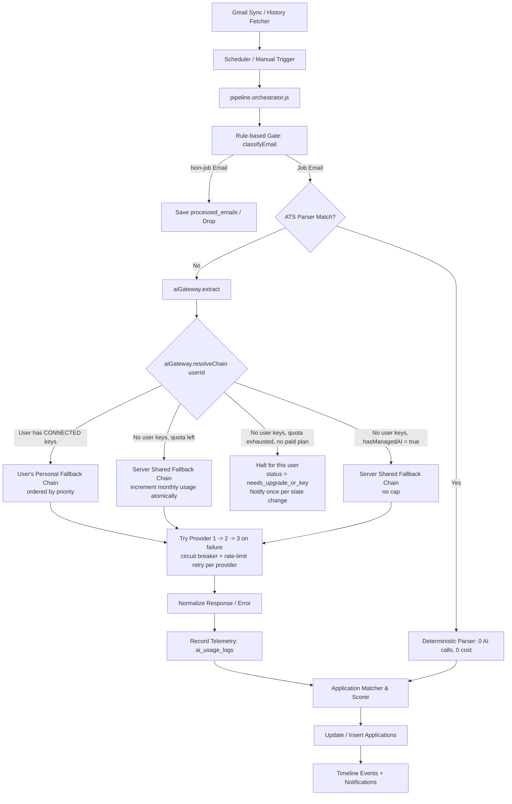
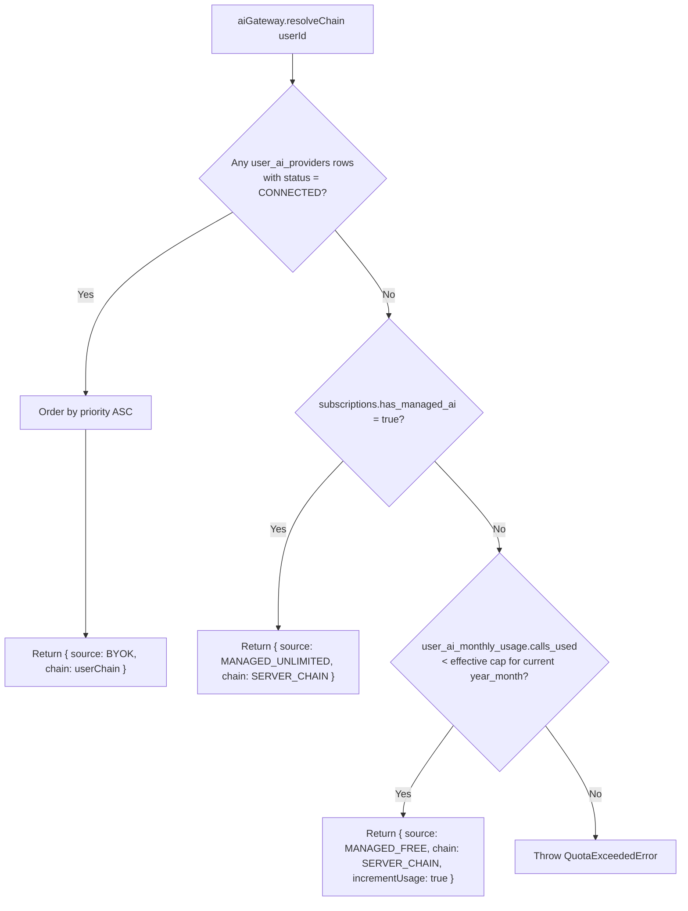
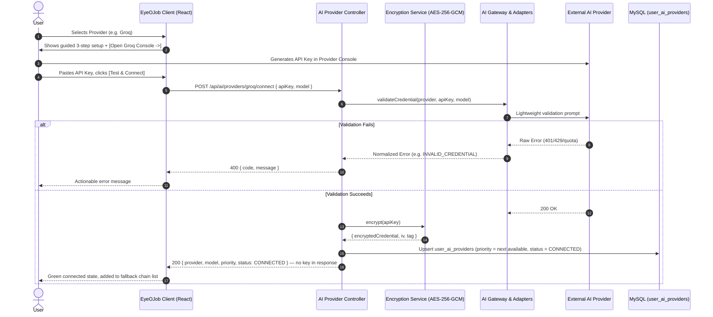
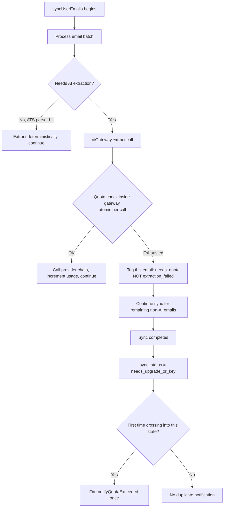
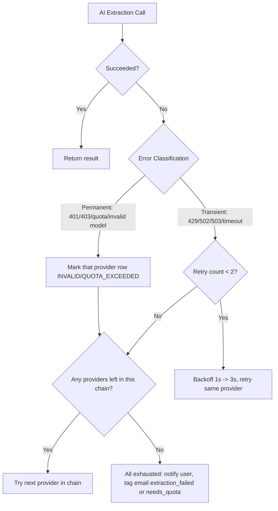

# EyeOJob — Hybrid AI Provider Architecture (BYOK + Managed Free Tier)

Status: **Phase 1 implemented and validated** — migration applied to dev DB, 159/159 automated tests passing, live end-to-end verification against real Groq/Gemini/xAI/Mistral APIs. See [Section 16 — Implementation Status](#16-implementation-status) for exactly what's validated vs still open.
Owner decision log: see [Section 12 — Decision Log](#12-decision-log)

---

## 1. Objective

Today, EyeOJob runs every user's email AI-extraction through a single set of server-owned API keys (`server/src/pipelines/email-pipeline/extraction/ai.extractor.js`), shared across all users, with a 6-provider fallback chain (Gemini → Cohere → OpenRouter → Cloudflare → HuggingFace → Groq). This is not sustainable once EyeOJob has real usage — the server pays for every user's AI calls with no cap and no revenue.

This document specifies a **three-tier hybrid model**:

1. **Free tier (default)** — every user gets a capped monthly allowance of AI calls, served by EyeOJob's existing shared fallback chain. Zero setup required — a new user syncs Gmail and sees results immediately.
2. **BYOK tier** — a user connects their own AI provider key(s) (multiple allowed, in priority order). Their extractions run entirely on their own quota, at zero cost to EyeOJob, with no monthly cap.
3. **Paid subscription (future seam only)** — a user pays for higher/unlimited server-managed usage without needing to get their own key. Not implemented now; only the architectural seam (a `subscriptions` table and a branch in the resolver) is built so it can be added later without touching the pipeline.

**Non-negotiables carried over from the original BYOK proposal:**
- No AI provider ever receives a plaintext key from storage — encryption at rest (AES-256-GCM), decrypted only in-memory at call time.
- No cross-user credential access (strict `user_id` scoping, IDOR-proof).
- No credential ever appears in a log, error report, or API response.
- The email pipeline (classification, matching, timeline) needs **zero modification** — only the AI-calling layer changes.

---

## 2. Why Hybrid, Not Pure BYOK

Pure BYOK (require a key before any sync) was the original proposal. Rejected because:

| | Pure BYOK | Hybrid (this doc) |
|---|---|---|
| Day-1 experience | Hard block — user must find/paste an API key before seeing any value | Instant — free tier works with zero setup |
| Conversion to BYOK | Low — friction before any payoff | Higher — users add a key after seeing the product work, to remove the cap |
| Server cost | $0 always | Capped and bounded (~$0.00–0.03/user/month at 150 calls) |
| Future monetization | Bolted on later | Seam built in from day one (`subscriptions` table, resolver branch) |

---

## 3. Architecture Diagrams

### 3.1 End-to-End Orchestration Flow



### 3.2 Provider Resolution Logic (the core new decision point)



### 3.3 Credential Setup & Validation Flow (unchanged from original proposal)



### 3.4 Quota Exhaustion Mid-Sync



### 3.5 Retry / Error Classification (carried over, applies to both BYOK and server chains)



---

## 4. Database Schema

### 4.1 `user_ai_providers` — supports multiple rows per user (personal fallback chain)

```sql
CREATE TABLE IF NOT EXISTS user_ai_providers (
  id INT AUTO_INCREMENT PRIMARY KEY,
  user_id INT NOT NULL,
  provider VARCHAR(50) NOT NULL COMMENT 'groq, gemini, xai, openrouter, mistral, ...',
  encrypted_credential TEXT NOT NULL COMMENT 'AES-256-GCM: hex(iv):hex(ciphertext):hex(tag)',
  credential_type ENUM('api_key', 'oauth_token') NOT NULL DEFAULT 'api_key',
  model VARCHAR(100) NOT NULL,
  priority INT NOT NULL DEFAULT 0 COMMENT 'Lower = tried first in this user''s fallback chain',
  status ENUM(
    'CONNECTED','INVALID','EXPIRED','REVOKED',
    'QUOTA_EXCEEDED','RATE_LIMITED','ERROR','DISCONNECTED'
  ) NOT NULL DEFAULT 'CONNECTED',
  last_validated_at DATETIME NULL,
  last_used_at DATETIME NULL,
  last_error_code VARCHAR(50) NULL,
  last_error_message VARCHAR(255) NULL,
  created_at DATETIME NOT NULL DEFAULT CURRENT_TIMESTAMP,
  updated_at DATETIME NOT NULL DEFAULT CURRENT_TIMESTAMP ON UPDATE CURRENT_TIMESTAMP,
  UNIQUE KEY uq_user_provider (user_id, provider),
  KEY idx_user_priority (user_id, priority),
  CONSTRAINT fk_user_ai_providers_user FOREIGN KEY (user_id) REFERENCES users (id) ON DELETE CASCADE
) ENGINE=InnoDB DEFAULT CHARSET=utf8mb4 COLLATE=utf8mb4_unicode_ci;
```

Note: no `is_active` single-winner flag — `priority` replaces it. A user can have several `CONNECTED` rows; all of them participate in that user's personal chain, same shape as the server-side chain today.

### 4.2 `ai_usage_logs` — per-call telemetry (safe, no sensitive content)

```sql
CREATE TABLE IF NOT EXISTS ai_usage_logs (
  id BIGINT AUTO_INCREMENT PRIMARY KEY,
  user_id INT NOT NULL,
  provider VARCHAR(50) NOT NULL,
  model VARCHAR(100) NOT NULL,
  source ENUM('BYOK','MANAGED_FREE','MANAGED_UNLIMITED') NOT NULL,
  operation VARCHAR(50) NOT NULL DEFAULT 'email_extraction',
  latency_ms INT NOT NULL,
  success TINYINT(1) NOT NULL,
  error_category VARCHAR(50) NULL,
  prompt_tokens INT NULL,
  completion_tokens INT NULL,
  total_tokens INT NULL,
  created_at DATETIME NOT NULL DEFAULT CURRENT_TIMESTAMP,
  KEY idx_user_created (user_id, created_at),
  CONSTRAINT fk_ai_usage_logs_user FOREIGN KEY (user_id) REFERENCES users (id) ON DELETE CASCADE
) ENGINE=InnoDB DEFAULT CHARSET=utf8mb4 COLLATE=utf8mb4_unicode_ci;
```

`source` column added vs. the original design — lets the usage dashboard (Section 8) show why a given call ran where it ran.

### 4.3 `user_ai_monthly_usage` — free-tier quota tracking (new)

```sql
CREATE TABLE IF NOT EXISTS user_ai_monthly_usage (
  id BIGINT AUTO_INCREMENT PRIMARY KEY,
  user_id INT NOT NULL,
  year_month CHAR(7) NOT NULL COMMENT 'UTC, e.g. 2026-09',
  calls_used INT NOT NULL DEFAULT 0,
  quota_notified TINYINT(1) NOT NULL DEFAULT 0 COMMENT 'Debounce flag: notifyQuotaExceeded fired once per month per user',
  updated_at DATETIME NOT NULL DEFAULT CURRENT_TIMESTAMP ON UPDATE CURRENT_TIMESTAMP,
  UNIQUE KEY uq_user_month (user_id, year_month),
  CONSTRAINT fk_user_ai_monthly_usage_user FOREIGN KEY (user_id) REFERENCES users (id) ON DELETE CASCADE
) ENGINE=InnoDB DEFAULT CHARSET=utf8mb4 COLLATE=utf8mb4_unicode_ci;
```

- One row per user per calendar month. `year_month` is always computed in **UTC** — decided once here so rollover behavior is unambiguous regardless of the user's timezone (see Decision Log #4).
- No cron/reset job needed — a new month simply gets a new row via `INSERT ... ON DUPLICATE KEY UPDATE`.
- `quota_notified` prevents the notification from firing on every blocked sync attempt — it's set to `1` the first time the user crosses into `needs_upgrade_or_key` for that month, and reset to `0` only when a new `year_month` row is created.

### 4.4 `subscriptions` — future seam only, created now, not wired to any billing UI

```sql
CREATE TABLE IF NOT EXISTS subscriptions (
  user_id INT PRIMARY KEY,
  plan ENUM('free', 'pro') NOT NULL DEFAULT 'free',
  has_managed_ai TINYINT(1) NOT NULL DEFAULT 0,
  monthly_call_cap INT NULL COMMENT 'NULL = use global FREE_MONTHLY_CAP; set to override per-user',
  renews_at DATETIME NULL,
  created_at DATETIME NOT NULL DEFAULT CURRENT_TIMESTAMP,
  CONSTRAINT fk_subscriptions_user FOREIGN KEY (user_id) REFERENCES users (id) ON DELETE CASCADE
) ENGINE=InnoDB DEFAULT CHARSET=utf8mb4 COLLATE=utf8mb4_unicode_ci;
```

Every user defaults to `plan = 'free'`. No payment flow is built in this phase — this table exists purely so `resolveChain()` has a stable branch to check, and a future billing feature only needs to write rows here, never touch the pipeline.

### 4.5 `processed_emails` — new status value

Add `needs_quota` as a distinct status alongside the existing `extraction_failed`:

| Status | Meaning | Retry behavior |
|---|---|---|
| `extraction_failed` | Transient provider error (timeout, all providers down) | Retried on next sync automatically |
| `needs_quota` | Blocked purely by free-tier cap, extraction never attempted | Retried only after quota resets (new month) or a BYOK key is connected — never retried pointlessly every sync |

This distinction matters because of the mid-sync quota fix (Section 3.4) — without it, a quota-blocked email and a genuinely-failed one look identical to the retry logic.

---

## 5. AI Gateway — Module Layout

```
server/src/modules/ai/
├── index.js                      # Module exports
├── ai.gateway.js                 # resolveChain(), executeExtraction()
├── ai.service.js                 # High-level business facade
├── ai.controller.js              # REST API controllers
├── ai.routes.js                  # Express route definitions
├── ai.repository.js              # user_ai_providers, ai_usage_logs, user_ai_monthly_usage access
├── config/
│   └── providers.config.js       # Central data-driven provider registry (see Section 7)
├── security/
│   └── encryption.service.js     # AES-256-GCM encrypt/decrypt
├── adapters/
│   ├── base.adapter.js           # Abstract BaseAIProvider — reused by BOTH server chain and BYOK chain
│   ├── groq.adapter.js
│   ├── gemini.adapter.js
│   ├── xai.adapter.js
│   ├── openrouter.adapter.js
│   └── mistral.adapter.js
└── errors/
    └── ai.errors.js              # Normalized AI error taxonomy (Section 9)
```

### 5.1 Base AI Provider Contract

```javascript
class BaseAIProvider {
  constructor(config) {
    this.providerId = config.id;
    this.displayName = config.displayName;
    this.defaultModel = config.defaultModel;
  }

  async validate(apiKey, model) {
    throw new Error('validate() must be implemented by adapter');
  }

  async extract(apiKey, model, prompt, options = {}) {
    throw new Error('extract() must be implemented by adapter');
  }

  normalizeError(error) {
    throw new Error('normalizeError() must be implemented by adapter');
  }
}
```

Note: the existing `ai.extractor.js` provider callers (`callGroq`, `callGemini`, `callOpenRouter`, `callCloudflare`, `callCohere`, `callHuggingFace`) already implement equivalent logic in a flatter, module-level style. Migrating them into this adapter class shape is mechanical — the prompt, parsing, timeout, circuit-breaker, and rate-limit-retry logic (`ai.extractor.js:672–973`) is preserved as-is and reused by both the server chain and each user's BYOK chain, just parameterized by `apiKey` instead of reading from `env.ai.*` module constants.

### 5.2 Gateway Resolution (pseudocode)

```javascript
async function resolveChain(userId) {
  const userProviders = await aiRepository.getConnectedProviders(userId); // ordered by priority ASC
  if (userProviders.length > 0) {
    return { source: 'BYOK', chain: userProviders.map(toAdapter) };
  }

  const sub = await subscriptionRepository.get(userId); // { plan: 'free', hasManagedAi: false } for everyone today
  if (sub.hasManagedAi) {
    return { source: 'MANAGED_UNLIMITED', chain: SERVER_CHAIN };
  }

  const yearMonth = currentUtcYearMonth();
  const usage = await usageRepository.getOrCreateMonthlyUsage(userId, yearMonth);
  const cap = sub.monthlyCallCap ?? FREE_MONTHLY_CAP;
  if (usage.callsUsed >= cap) {
    throw new QuotaExceededError({ userId, cap, used: usage.callsUsed });
  }

  return { source: 'MANAGED_FREE', chain: SERVER_CHAIN, incrementUsage: true, yearMonth };
}
```

### 5.3 BYOK Chain Isolation Rule

**If a user has connected BYOK keys, their chain never silently falls back to server keys.**

- User Provider 1 (e.g. Groq) fails → try User Provider 2 (e.g. Gemini) → ... → if all user keys fail, mark the email `extraction_failed` and notify "your connected AI keys are failing," never spend server budget on their behalf.
- Rationale: falling back to server keys would (a) create unbounded server cost exposure from BYOK users whose keys happen to be broken, and (b) mask a broken key from the user, who would never notice it needs fixing.

### 5.4 Per-Call Quota Increment (atomic)

Quota is checked and incremented **inside `aiGateway.extract`, per AI call** — not once at the start of a sync — so a user with 3 calls remaining but 15 emails needing extraction doesn't overrun the cap by 12.

```sql
INSERT INTO user_ai_monthly_usage (user_id, year_month, calls_used)
VALUES (?, ?, 1)
ON DUPLICATE KEY UPDATE calls_used = calls_used + 1;
```

When quota is hit mid-sync: that specific email is tagged `needs_quota` (Section 4.5), the sync continues processing any remaining emails that don't need AI (ATS-parser hits, non-job emails), and concludes with `sync_status = needs_upgrade_or_key`.

---

## 6. Gatekeeper & Scheduler Changes

### 6.1 No hard block on new users

Unlike the original pure-BYOK proposal (`needs_ai_provider`, blocking sync entirely), the revised gate only fires as **`needs_upgrade_or_key`**, and only once free quota is exhausted with no BYOK key connected. A brand-new user with zero setup syncs immediately on the free tier.

### 6.2 Scheduler exclusion (prevents notification/Gmail-quota waste)

Without this, a user stuck at `needs_upgrade_or_key` would be picked up by the scheduler every cycle, re-fetch Gmail, immediately hit `QuotaExceededError`, and re-fire a notification — burning Gmail API quota and spamming the user, potentially dozens of times a day.

```sql
-- pipeline.repository.js: getSchedulerEligibleUserIds
AND (s.status IS NULL OR s.status NOT IN ('stopped', 'needs_reconnect', 'needs_upgrade_or_key'))
```

### 6.3 Auto-unblock conditions

A user in `needs_upgrade_or_key` becomes scheduler-eligible again automatically when any of:
1. They connect a valid BYOK key (`POST /connect` succeeds) — chain resolution now returns `BYOK` before quota is even checked.
2. The calendar month rolls over (new `year_month` row, `calls_used` resets to 0 implicitly).
3. They manually click "Sync Gmail" in the dashboard (manual trigger bypasses scheduler eligibility filtering — user explicitly asked for it, so at minimum let ATS-parsed/non-AI emails process, and surface the quota state clearly if AI-needed emails are still blocked).

### 6.4 Orchestrator gate

```javascript
// pipeline.orchestrator.js — syncUserEmails(userId)
try {
  const { source, chain } = await aiGateway.resolveChain(userId);
} catch (err) {
  if (err instanceof QuotaExceededError) {
    await repository.completeSyncNeedsUpgradeOrKey(userId);
    const usage = await usageRepository.getMonthlyUsage(userId, currentUtcYearMonth());
    if (!usage.quotaNotified) {
      await notificationsService.notifyQuotaExceeded({ userId });
      await usageRepository.markQuotaNotified(userId, currentUtcYearMonth());
    }
    return; // expected end state, not a hard error — do not throw
  }
  throw err;
}
```

### 6.5 Initial full-history sync throttle

A new user's first sync can pull years of Gmail history. If that backfill needs AI extraction on old emails, it can exhaust the entire monthly quota before the user has seen any real value from the product.

**Mitigation:** process the first sync **newest-to-oldest** so the most relevant/recent emails get extracted before quota runs out, rather than the reverse. (Whether to additionally hard-cap the first sync to a rolling window, e.g. "last 6 months first, older on request," is left as an implementation-time decision — not required for the architecture to work, but worth doing if 150/month proves too tight against real backfill volumes.)

---

## 7. Provider Configuration Registry

Centralized, data-driven — one source of truth for both the server chain and every BYOK adapter (same shape, since adapters are reused).

```javascript
// server/src/modules/ai/config/providers.config.js
module.exports = {
  groq: {
    id: 'groq',
    displayName: 'Groq',
    tagline: 'Ultra-fast LPU inference engine',
    setupUrl: 'https://console.groq.com/keys',
    docsUrl: 'https://console.groq.com/docs/quickstart',
    credentialType: 'api_key',
    defaultModel: 'openai/gpt-oss-20b',
    supportedModels: [
      { id: 'openai/gpt-oss-20b', name: 'GPT OSS 20B (Recommended)', isDefault: true },
      { id: 'llama-3.3-70b-versatile', name: 'Llama 3.3 70B Versatile' },
    ],
    setupInstructions: [
      'Open the official Groq Console via the link above.',
      'Sign in and navigate to "API Keys".',
      'Click "Create API Key", name it "EyeOJob", and copy the key.',
      'Return here, paste the key, and click "Test & Connect".',
    ],
  },
  gemini: {
    id: 'gemini',
    displayName: 'Google Gemini',
    setupUrl: 'https://aistudio.google.com/app/apikey',
    docsUrl: 'https://ai.google.dev/gemini-api/docs',
    credentialType: 'api_key',
    defaultModel: 'gemini-flash-lite-latest',
    supportedModels: [
      { id: 'gemini-flash-lite-latest', name: 'Gemini Flash Lite (Recommended)', isDefault: true },
      { id: 'gemini-1.5-flash', name: 'Gemini 1.5 Flash' },
    ],
    setupInstructions: [
      'Open Google AI Studio via the link above.',
      'Click "Create API key".',
      'Copy the generated key and paste it below.',
    ],
  },
  openrouter: {
    id: 'openrouter',
    displayName: 'OpenRouter',
    setupUrl: 'https://openrouter.ai/keys',
    docsUrl: 'https://openrouter.ai/docs',
    credentialType: 'api_key',
    defaultModel: 'deepseek/deepseek-v4-flash-0731:free',
    supportedModels: [
      { id: 'deepseek/deepseek-v4-flash-0731:free', name: 'DeepSeek V4 Flash (Free)', isDefault: true },
    ],
    setupInstructions: [
      'Open the OpenRouter Keys page.',
      'Create a new key.',
      'Copy and paste below.',
    ],
  },
  xai: {
    id: 'xai',
    displayName: 'xAI / Grok',
    setupUrl: 'https://console.x.ai',
    docsUrl: 'https://docs.x.ai',
    credentialType: 'api_key',
    defaultModel: 'grok-2-mini',
    supportedModels: [{ id: 'grok-2-mini', name: 'Grok 2 Mini (Recommended)', isDefault: true }],
    setupInstructions: [
      'Open the xAI Console.',
      'Create an API key.',
      'Copy and paste below.',
    ],
  },
  mistral: {
    id: 'mistral',
    displayName: 'Mistral AI',
    setupUrl: 'https://console.mistral.ai/api-keys/',
    docsUrl: 'https://docs.mistral.ai/',
    credentialType: 'api_key',
    defaultModel: 'mistral-small-latest',
    supportedModels: [{ id: 'mistral-small-latest', name: 'Mistral Small (Recommended)', isDefault: true }],
    setupInstructions: [
      'Sign in to Mistral La Plateforme.',
      'Generate an API key.',
      'Copy and paste below.',
    ],
  },
};
```

---

## 8. Credential Encryption Design

### 8.1 Cryptographic spec
- **Algorithm**: AES-256-GCM via Node's native `crypto`.
- **IV**: 12 bytes, `crypto.randomBytes(12)`, never reused.
- **Auth tag**: 16 bytes.
- **Storage format**: `hex(iv):hex(ciphertext):hex(tag)`.

### 8.2 Key management
- **Now (dev/current infra)**: master key read from `AI_CREDENTIAL_ENCRYPTION_KEY` env var, validated at process startup (must be exactly 32 bytes / 64 hex chars). This project runs on XAMPP + a local/VPS MySQL instance today — there is no AWS infrastructure in place, so this is the actual target, not a placeholder.
- **Later, only if/when cloud deployment happens**: migrate the master key into AWS Secrets Manager / KMS CMK. Deferred — do not build this now.
- The master key is never stored in MySQL, ever.

### 8.3 Zero-leakage guarantees
- Credentials are encrypted immediately on receipt in `POST /connect`.
- Decryption happens only inside `ai.gateway.js`, immediately before the provider HTTP call, held in function-local variables only.
- Logger redaction strips `apiKey`, `credential`, `authorization` fields before any log line is written.
- No endpoint ever returns `encrypted_credential` in a response body.

---

## 9. Error Taxonomy

| Error Code | HTTP | Type | Behavior |
|---|---|---|---|
| `INVALID_CREDENTIAL` | 401 | Permanent | Mark that provider row `INVALID`. Move to next provider in chain (user or server). Notify if it was the user's own key. |
| `RATE_LIMITED` | 429 | Transient | Retry with backoff (1s → 3s). If exhausted, move to next provider in chain. |
| `QUOTA_EXCEEDED` (provider-side) | 402/429 | Permanent | Mark that provider row `QUOTA_EXCEEDED`. Move to next provider in chain. |
| `PROVIDER_UNAVAILABLE` | 502/503/504 | Transient | Retry with backoff, then move to next provider. |
| `UNSUPPORTED_MODEL` | 400/404 | Permanent | Mark row `ERROR`. Prompt user to pick a supported model. |
| `AUTHORIZATION_FAILED` | 403 | Permanent | Mark row `INVALID` — key lacks permissions. |
| `UNKNOWN_PROVIDER_ERROR` | 500 | Unknown | Log sanitized error, move to next provider. |
| *(app-level)* `QuotaExceededError` | — | Free-tier cap hit | Not a provider error — thrown by `resolveChain()` before any provider is even called. Triggers `needs_upgrade_or_key`. |

This reuses the circuit-breaker (3 consecutive failures → 10min cooldown) and rate-limit-aware retry logic already implemented in `ai.extractor.js:913–973` — applied per-provider regardless of whether the key is server-owned or user-owned.

---

## 10. API Endpoint Contract

All endpoints require auth middleware; every query strictly scoped `WHERE user_id = req.user.id`.

| Method | Endpoint | Description | Request | Response |
|---|---|---|---|---|
| `GET` | `/api/ai/providers` | Catalog of all available providers | — | `[{ id, displayName, setupUrl, docsUrl, supportedModels, defaultModel }]` |
| `GET` | `/api/ai/providers/connected` | User's connected providers, in chain order | — | `[{ id, provider, model, priority, status, last_validated_at, last_used_at }]` |
| `GET` | `/api/ai/providers/:provider/setup` | Guided setup instructions | — | `{ provider, setupUrl, docsUrl, steps, supportedModels }` |
| `POST` | `/api/ai/providers/:provider/validate` | Test a key without saving | `{ apiKey, model? }` | `{ valid: true, latencyMs }` |
| `POST` | `/api/ai/providers/:provider/connect` | Validate, encrypt, save | `{ apiKey, model? }` | `{ success: true, provider: { id, provider, model, priority, status: 'CONNECTED' } }` |
| `PATCH` | `/api/ai/providers/:id` | Update model/settings | `{ model }` | `{ success: true, provider }` |
| `POST` | `/api/ai/providers/:id/test` | Re-test a stored credential | — | `{ valid: true, latencyMs, status }` |
| `PUT` | `/api/ai/providers/priorities` | Reorder the user's fallback chain (bulk, one transaction — avoids race conditions from one-by-one updates) | `{ providerIds: [3, 1, 5] }` (ordered highest→lowest priority) | `{ success: true, order: [...] }` |
| `DELETE` | `/api/ai/providers/:id` | Disconnect & delete encrypted key | — | `{ success: true }` |
| `GET` | `/api/ai/usage/monthly` | Current month's free-tier usage | — | `{ yearMonth, callsUsed, cap, source }` |
| `GET` | `/api/ai/usage` | Aggregated usage metrics | `?days=30` | `{ totalRequests, successCount, failureCount, breakdownByProvider }` |

`PUT /priorities` implementation (single transaction, avoids duplicate-rank races from per-item PATCH):
```sql
UPDATE user_ai_providers
SET priority = CASE id
  WHEN 3 THEN 0
  WHEN 1 THEN 1
  WHEN 5 THEN 2
END
WHERE user_id = ? AND id IN (3, 1, 5);
```

---

## 11. Frontend UX Flow

1. **New user, no key connected**: dashboard works immediately on the free tier. Persistent small indicator: "Free plan — 42/150 AI calls used this month."
2. **Approaching cap (≥80%)**: dismissible banner — "You're close to your monthly free limit. Add your own API key for unlimited use, or upgrade."
3. **Cap hit**: sync pauses with a clear card, two actions side by side:
   - `[ Connect Your API Key ]` (fully functional)
   - `[ Upgrade Plan ]` (disabled/"Coming soon" until billing exists — Section 4.4 seam)
4. **AI Providers settings page**: a **reorderable list** (drag-and-drop or up/down arrows) of connected providers — not a single "active provider" slot. Reflects the personal-fallback-chain mental model: "Groq, then Gemini, then OpenRouter."
5. **Usage dashboard**: shows `source` (free / byok / managed) per recent call, so users understand which tier served each extraction.
6. **Sidebar**: new "AI Providers" nav item (icon: Sparkles/Cpu). Notification badge if any connected provider status is `INVALID` or `QUOTA_EXCEEDED`, or if the account is in `needs_upgrade_or_key`.

---

## 12. Decision Log

Decisions made during design discussion, with rationale, so future changes can be evaluated against *why*, not just *what*:

1. **Hybrid over pure BYOK** — pure BYOK blocks day-1 value; hybrid lets users experience the product before being asked to do anything technical.
2. **Multiple BYOK keys per user, priority-ordered** — user explicitly wanted the existing fallback-chain reliability model preserved, just scoped per-user instead of server-wide.
3. **Free tier cap is monthly, not daily** — user explicitly requested monthly over daily (daily was the initial default suggestion).
4. **`year_month` computed in UTC** — avoids ambiguous rollover behavior for users in different timezones; picked once so it never needs revisiting per-feature.
5. **BYOK never silently falls back to server keys** — protects server cost from a user's broken key, and surfaces the breakage to the user instead of masking it.
6. **Quota checked/incremented per AI call, not once per sync** — prevents overrunning the cap when a sync has more AI-needed emails than remaining quota.
7. **`needs_quota` is a distinct email status from `extraction_failed`** — the former should only retry after quota resets or a key is added; conflating them would cause pointless retries every sync.
8. **Notification debounce via `quota_notified` flag** — prevents `notifyQuotaExceeded` firing on every blocked sync attempt.
9. **`FREE_MONTHLY_CAP` starting value: 150** — estimated to cover 90%+ of genuine job-seeker usage (30–60 real AI extractions/month typical) at near-zero cost on free-tier providers, while still bounding abuse/scraper exposure. Configurable via `AI_FREE_MONTHLY_CAP` env var — revisit after real usage data from `ai_usage_logs`.
10. **AWS KMS/Secrets Manager deferred** — no cloud infra exists yet (project runs on XAMPP + local/VPS MySQL); env-var master key is the real target until cloud deployment is actually planned.
11. **Managed-AI paid tier is a seam only, not implemented** — no billing/subscription system exists in the codebase; only the `subscriptions` table and `resolveChain()` branch are built now so it can be added later without pipeline changes.
12. **Initial full-history sync processes newest-to-oldest** — prevents a new user's backfill from exhausting the entire monthly quota on old emails before they've seen the product work on recent ones.

### Open items still needing a decision before/during implementation:
- Whether to additionally hard-cap the *first* sync to a rolling window (e.g. last 6 months) — not required for correctness, worth doing only if 150/month proves too tight against real backfill volumes.
- Tying free-tier quota grant to a verified account state (email verified / account age > N hours) to blunt multi-account abuse — not yet designed, flagged as a risk in Section 13.
- Exact wording/design of the `needs_upgrade_or_key` dashboard card and upgrade CTA (placeholder "Coming soon" until billing exists).

---

## 13. Known Risks / Things to Watch

| Risk | Mitigation status |
|---|---|
| Multi-account abuse of free tier (create N accounts for N×150 calls) | Not yet designed — flagged in Section 12 open items. Consider gating quota grant on verified email / account age. |
| First-sync quota exhaustion on historical backfill | Mitigated by newest-to-oldest processing order (Section 6.5); rolling-window hard cap is an open item. |
| Cost creep if 150/month estimate is wrong | Mitigated by `ai_usage_logs.source` breakdown — monitor total `MANAGED_FREE` calls × rough per-call cost periodically; adjust `AI_FREE_MONTHLY_CAP` env var, no code change needed. |
| Existing users breaking on rollout (schema/gate change) | Migration must backfill every existing user into `subscriptions(plan='free')` and `user_ai_monthly_usage` for the current month with `calls_used = 0` before the gate goes live, so nobody is retroactively treated as already-exhausted. |

---

## 14. Migration / Rollout Plan

1. **Schema migration**: create `user_ai_providers` (revised, with `priority`), `ai_usage_logs`, `user_ai_monthly_usage`, `subscriptions`; add `needs_quota` to `processed_emails` status enum. Backfill `subscriptions(plan='free')` for all existing users.
2. **Core AI module**: `encryption.service.js`, `providers.config.js`, adapters (migrate existing `callGroq`/`callGemini`/etc. logic from `ai.extractor.js` into the adapter shape, preserving circuit-breaker/retry/timeout behavior), `ai.gateway.js` (`resolveChain`, `executeExtraction`), `ai.repository.js`.
3. **API + UI**: `/api/ai/providers/*` routes/controllers; AI Providers settings page (reorderable chain list), setup modal, dashboard usage indicator/banner, upgrade-or-key card.
4. **Pipeline integration**: update `pipeline.orchestrator.js` gate (Section 6.4) and `scheduler.js` eligibility query (Section 6.2). Replace direct `ai.extractor.js` calls in `processEmail` with `aiGateway.extract({ userId, ... })`.
5. **Cutover**: existing server-side env keys (`GROQ_API_KEY`, `GEMINI_API_KEY`, etc.) become the `SERVER_CHAIN` used by `MANAGED_FREE`/`MANAGED_UNLIMITED` sources — no change to `.env`, just a new caller. Old direct-call path in `ai.extractor.js` is retired once `aiGateway` is wired in everywhere.

---

## 15. Test Strategy

1. **Unit**: encryption roundtrip + tamper detection; adapter error normalization (401→`INVALID_CREDENTIAL`, 429→`RATE_LIMITED`); `resolveChain()` branch coverage (BYOK / managed-unlimited / managed-free / quota-exceeded).
2. **Integration/API**: IDOR protection (user A cannot touch user B's providers); `connected` endpoint never leaks `encrypted_credential`; `PUT /priorities` is atomic and rejects IDs not owned by the caller.
3. **Pipeline**: sync completes cleanly with `needs_upgrade_or_key` when quota exhausted and no BYOK key; mid-sync quota exhaustion tags only AI-needed emails `needs_quota` while ATS-parsed emails still complete; BYOK chain never falls back to server keys on failure; scheduler excludes `needs_upgrade_or_key` users; notification fires exactly once per month per user hitting the cap.

---

## 16. Implementation Status

Phase 1 landed directly against this spec. What's actually in the repo right now:

### Backend — done
- **Migration**: `server/migrations/add_byok_ai_provider_tables.sql` — creates `user_ai_providers`, `ai_usage_logs`, `user_ai_monthly_usage`, `subscriptions`; backfills every existing user to `plan='free'`; extends `sync_status.status` with `needs_upgrade_or_key`. **Not yet applied to any live database** — run it manually (this project has no migration runner; see Section 4's original note) before testing BYOK end-to-end.
- **Shared prompt**: the extraction prompt + JSON parser were extracted out of `ai.extractor.js` into `server/src/pipelines/email-pipeline/extraction/prompt.builder.js` so the server chain and every BYOK adapter use byte-identical extraction logic. `ai.extractor.js` itself is otherwise untouched — its full 6-provider fallback chain, circuit breaker, and rate-limit retry still serve `MANAGED_FREE`/`MANAGED_UNLIMITED` calls exactly as before.
- **`server/src/modules/ai-providers/`** — full module: `encryption.service.js` (AES-256-GCM, lazy-validated master key), `config/providers.config.js` (groq/gemini/openrouter/xai/mistral catalog), `adapters/` (`base.adapter.js` + one per provider, all sharing the prompt builder), `errors/ai.errors.js` (`AIProviderError`, `QuotaExceededError`, HTTP-status classifier), `ai-providers.repository.js`, `ai-providers.gateway.js` (`resolveChain`, `extract`, `notifyQuotaOnce`), `ai-providers.service.js`, `ai-providers.controller.js`, `ai-providers.routes.js`, `index.js`. Mounted at `/ai` in `server/src/routes/index.js`.
- **Pipeline wiring**: `pipeline.orchestrator.js` calls `aiGateway.extract(userId, ...)` instead of `extractJobDetails` directly; a `QuotaExceededError` mid-sync tags that email `needs_quota` (not `extraction_failed`) and the sync concludes as `needs_upgrade_or_key` rather than `success` if any email hit it. `pipeline.repository.js` gained `completeSyncNeedsUpgradeOrKey` and excludes that status from `getSchedulerEligibleUserIds`, mirroring `needs_reconnect`.
- **Notifications**: `notifyQuotaExceeded` added to `notifications.service.js`, debounced via `notifyQuotaOnce` in the gateway (checks/sets `user_ai_monthly_usage.quota_notified`).
- **Config**: `AI_CREDENTIAL_ENCRYPTION_KEY` and `AI_FREE_MONTHLY_CAP` added to `config/env.js` and `.env.example`.
- **Tests**: existing suite (76 tests) passes unchanged except one assertion updated for the new scheduler-exclusion SQL string (`syncLifecycleRepository.test.js`). No new BYOK-specific tests were written yet — see Section 15's list for what to add.

### Frontend — basic, functional, not polished
- `client/src/features/ai-providers/` — `api/ai-providers.api.js` (thin axios wrapper matching the existing `notifications.api.js` pattern), `components/AiProvidersPanel.jsx` (catalog + inline connect form + reorderable connected-provider list with up/down arrows, not drag-and-drop), `components/MonthlyUsageBanner.jsx` (silent unless ≥80% of free quota used).
- Wired into `DashboardLayout.jsx` (sidebar nav item) and `Home.jsx` (tab content, overview banner, `needs_upgrade_or_key` toast message).
- Client builds clean (`vite build` passes). **Not manually tested in a running browser** — no dev server was started against a live backend/DB during this implementation pass.

### Deliberately not built (per the doc's own scope)
- AWS KMS/Secrets Manager (Section 8.2) — env var only, as specified.
- `subscriptions`/paid-tier billing flow (Section 4.4) — table + `resolveChain()` branch exist; no payment UI, no way to actually set `has_managed_ai = 1` outside direct DB access.
- Multi-account abuse gating (Section 13 risk) — free quota is granted the instant `subscriptions` gets a row for a user; no email-verification/account-age gate yet.
- First-sync rolling-window throttle (Section 6.5's open item) — newest-to-oldest ordering was **not** added to `historyFetcher.js`'s full re-list path; a new user's very first sync can still exhaust the monthly cap on old backfill before recent emails. This is the single biggest gap versus the design and worth doing next.
- Full circuit-breaker/rate-limit-retry parity for BYOK chains — the BYOK path in `ai-providers.gateway.js` does a straightforward per-provider timeout + try-next-in-chain; it does not replicate the server chain's 3-strikes circuit breaker or automatic 429 retry-with-backoff. Reasonable for now given BYOK chains are short (1-3 providers), but worth revisiting if it causes noticeably worse reliability than the server chain.
- xAI and Mistral adapters were written against their documented OpenAI-compatible endpoints but **not verified against live APIs** the way the original `ai.extractor.js` providers were (see that file's comments on providers that were tried and rejected) — test with a real key before trusting them in production.

### Validation pass (2026-09-20) — what changed since Phase 1

1. **Bug found and fixed during migration**: `year_month` is a reserved keyword in MariaDB (it's a valid `INTERVAL` unit specifier) — `CREATE TABLE user_ai_monthly_usage` failed outright. Column renamed to `period_month` everywhere (migration SQL, repository).
2. **Gap found and fixed**: `ai-providers.gateway.js`'s managed-tier branch (`MANAGED_FREE`/`MANAGED_UNLIMITED`) never wrote to `ai_usage_logs` — only BYOK calls did. This silently broke Section 13's cost-visibility mitigation ("monitor `ai_usage_logs.source` breakdown"). Fixed by diffing `stats.aiProviderStats` before/after each `extractJobDetails()` call to attribute a usage-log row per provider the server chain actually tried, without changing that function's return shape.
3. **Migration applied** to the dev database (`eyeOjob` via XAMPP MySQL) — all 4 tables created, existing user backfilled to `plan='free'`, `sync_status.status` enum confirmed to include `needs_upgrade_or_key`.
4. **Automated test suite added** — 83 new tests across 6 files (encryption round-trip/tamper detection, gateway resolution branches + BYOK isolation, repository SQL/IDOR shape, adapter error normalization, route-level auth/IDOR/rate-limiting, orchestrator quota-exceeded routing). Combined with the existing 76, full suite is 159/159 passing.
5. **Live end-to-end validation** — a throwaway test user + the real Groq/Gemini/xAI/Mistral/OpenRouter keys already in `.env` were used to run actual network calls (not mocked) through: connect → live-validate → encrypt → store → extract (real Groq API call, real parsed result) → fallback chain (broken key at top priority → real API call → falls through to working key) → reorder → disconnect → quota exhaustion → BYOK un-blocking a quota-exhausted user. 21/22 live checks passed; the one failure (OpenRouter) is a pre-existing external condition (their free model slug rotated to paid-only — confirmed by hitting the same endpoint directly with the original *unmodified* server-chain code, which fails identically) and not a BYOK regression. xAI and Mistral don't have real keys available in this environment, so only their error-handling wiring was verified live (a fake key correctly reaches their real API and comes back as a normalized `INVALID_CREDENTIAL`/`UNSUPPORTED_MODEL` error) — the success path for those two is still unverified.
6. **Rate limiting added** to `/ai/providers/:provider/connect`, `/validate`, and `/:id/test` (Section 11) — 5 req/min per authenticated user (not per-IP, since these sit behind auth), reusing the existing `express-rate-limit` infrastructure and config pattern from `config/rateLimit.js`.
7. **First-sync backfill risk re-assessed** — turned out smaller than Section 6.5 assumed: `fetchMessageIdsFull` was already capped to `newer_than:30d` and 100 messages, not a user's entire mailbox history. No code change made here (a speculative reorder without a live Gmail session to verify against felt riskier than leaving documented, verified-safe behavior alone) — see the comment added directly in `historyFetcher.js`.

### Still open (not done in this pass, by explicit scope)
- AWS KMS/Secrets Manager, managed-subscription billing UI — deliberately deferred, no concrete deployment requirement yet.
- Multi-account abuse gating (free quota granted the instant a user row exists) — not implemented.
- xAI/Mistral success-path live verification — needs real keys.
- Full browser UI walkthrough — all validation in this pass was API/script-level against the real backend and DB, not a running browser session against the React UI.
