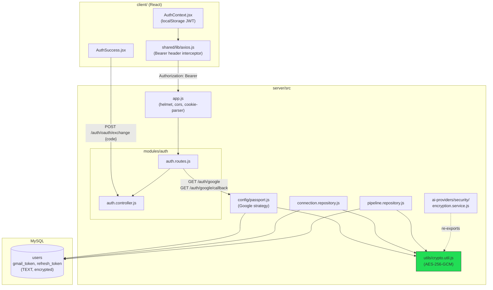
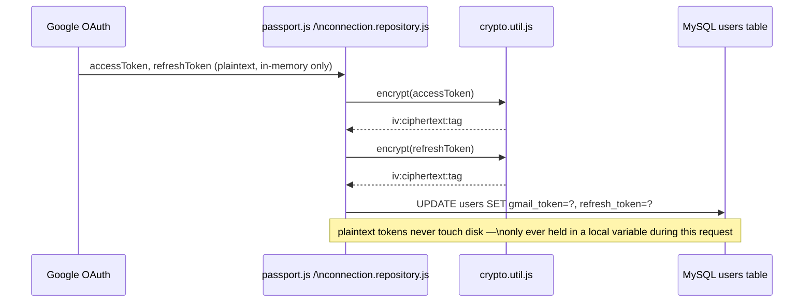
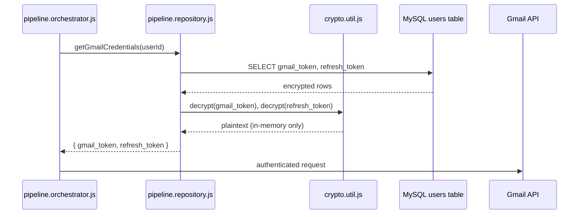
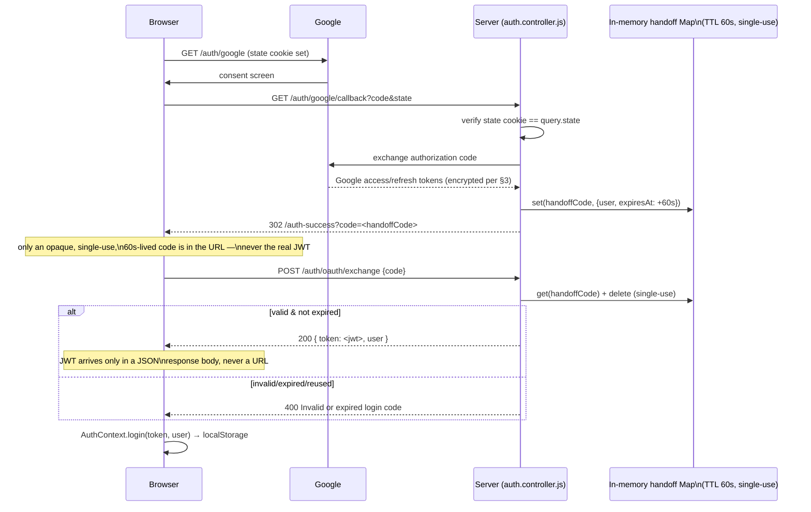
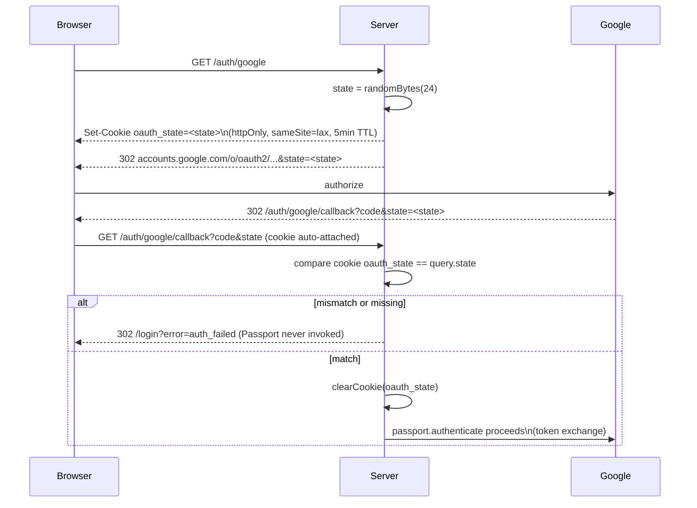
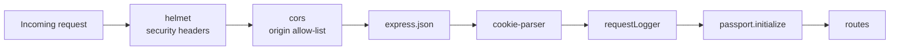

# Security Architecture — Pre-production Patch

Date: 2026-09-23
Scope: the auth + credential-storage security layer as it exists after this patch — design, data flow, and threat model for every piece touched. P2 (scheduler concurrency) and secrets-vaulting are called out at the end as explicitly out of scope (infra decisions, not vulnerabilities in this layer).

---

## 1. Threat model summary

| # | Asset at risk | Attacker capability assumed | Mitigation in this patch |
|---|---|---|---|
| 1 | Gmail access/refresh tokens in `users` table | Read access to a DB dump, backup, SSRF, or compromised read replica | AES-256-GCM encryption at rest (§3) |
| 2 | Session JWT (7-day bearer credential) | Browser history / Referer header / access logs on the OAuth redirect path | One-time handoff code replaces the JWT in the URL (§4) |
| 3 | User's Google account / this app's session | CSRF: victim's browser tricked into completing an OAuth flow the attacker initiated | Cookie-bound `state` parameter, verified server-side (§5) |
| 4 | Whole app, general web attack surface | MIME sniffing, clickjacking, missing transport hardening | `helmet()` default header set (§6) |
| 5 | Stale/dead code becoming a real bug | A "fixed later" no-op endpoint that looks functional | Removed dead `verify-reset-token` route (§7) |

Everything below is defense-in-depth layered on top of what was already solid: bcrypt password hashing, per-endpoint rate limiting, a MySQL-backed login-failure counter, OTP email verification, and service/repository layering. This patch does not change that baseline — it closes gaps found alongside it.

---

## 2. Component map

Where each piece of this security layer physically lives, and what depends on what:



`crypto.util.js` is the single source of encryption for two independent features (Gmail OAuth tokens, BYOK provider API keys) — one key, one implementation, verified once.

---

## 3. Credential encryption at rest

### 3.1 Design

AES-256-GCM (authenticated encryption — tampering with ciphertext is detected, not just theoretically prevented by opacity). Key comes from `AI_CREDENTIAL_ENCRYPTION_KEY` (32-byte hex env var), the same key already provisioned for the BYOK feature — no new secret to manage.

```
storage format:  hex(iv) : hex(ciphertext) : hex(authTag)
iv:              12 bytes, random per encryption call (crypto.randomBytes)
key:             32 bytes, loaded + validated lazily on first use, cached after
```

### 3.2 Write path (token issuance / refresh)



### 3.3 Read path (scheduled sync / manual refresh)



Decryption failure (`Malformed encrypted credential`, or GCM auth-tag mismatch) throws — a corrupted or tampered ciphertext never silently produces garbage credentials.

### 3.4 Schema

`users.gmail_token` / `users.refresh_token` widened to `TEXT` (`server/migrations/widen_gmail_token_columns.sql`). Rationale: encrypted form ≈ `iv(24 hex) + ciphertext(2x plaintext length in hex) + tag(32 hex)` — comfortably exceeds a `VARCHAR(255)` for real Google tokens, which would otherwise truncate silently and corrupt every stored credential.

### 3.5 Residual risk

- Tokens stored before this patch are plaintext and will fail to decrypt post-migration — users must reconnect Gmail once. No transparent backfill was written (would need to run directly against production data, out of scope for an application-code patch).
- The encryption key itself still lives in a flat `.env` (see §8 / "not addressed").

---

## 4. OAuth JWT handoff (no token in the URL)

### 4.1 Before

```
GET /auth/google/callback
  → 302 /auth-success?token=<live 7-day JWT>&user=<json>
```
The JWT sat in browser history, any third-party `Referer` header on the landing page, and every access/CDN log line for that request — for its entire lifetime, not just the redirect moment.

### 4.2 After



### 4.3 Why a handoff code and not a cookie-based session

The rest of the app is bearer-JWT-over-`Authorization`-header (see `shared/lib/axios.js`), not cookie sessions — switching the whole app to httpOnly session cookies would touch every API call, CORS config, and the logout/token-refresh flow. The handoff code achieves the actual security goal (no live credential in browser-visible surfaces) with a minimal, contained change: one Map, one new endpoint, one frontend file.

### 4.4 Properties

- **Single-use**: deleted from the Map on first read, valid or not.
- **Short-lived**: 60-second TTL, independent of the JWT's own 7-day expiry.
- **Opaque**: `crypto.randomBytes(32)` — not guessable, carries no information about the user.
- **Scoped**: rate-limited via the same `loginLimiter` as `/auth/login`.

---

## 5. OAuth CSRF protection (state binding)

### 5.1 The gap

`passport.authenticate('google', { session: false })` disables Passport's default session-backed `state` store (there is no `req.session` to store it in), and nothing in application code replaced it — so an attacker could initiate their own OAuth flow and trick a victim into completing it, silently binding the victim's browser to the attacker's Google identity.

### 5.2 The fix — double-submit via httpOnly cookie



Why this actually stops the CSRF: the cookie is scoped to *this browser*, set on the leg the victim must have initiated themselves. An attacker can get their own `state` value issued to their own browser, but can't make the victim's browser present it as a cookie — so a forged callback URL with the attacker's `code`/`state` pair fails the comparison on the victim's browser (no matching cookie).

`sameSite=lax` is intentional, not incidental: the cookie must still be sent on the top-level GET navigation Google's redirect performs (a cross-origin navigation from `accounts.google.com` back to this app), which `sameSite=strict` would block.

---

## 6. Security headers

`app.js` now runs `helmet()` ahead of every other middleware — the connection-level hardening (X-Content-Type-Options, X-Frame-Options, HSTS when served over TLS, etc.) applies to every response, including error responses, before any route-specific logic runs.



Defaults only — no custom CSP directives were authored, since this API serves JSON to a separate SPA rather than rendering HTML itself; helmet's default CSP is conservative but present. Revisit if the API ever serves HTML directly.

---

## 7. Dead code removal

`GET /auth/verify-reset-token` read from an in-memory `Map` that nothing populated (its writer had been commented out previously), so it always returned 400. Confirmed unused by the frontend (`client/src` has zero references). Removed rather than "fixed," because the real password-reset flow already exists end-to-end through MySQL-backed OTPs (`otp.repository.js` → `forgot-password` / `verify-reset-otp` / `reset-password`) and doesn't need this endpoint at all. Leaving a plausible-looking-but-dead endpoint in place is itself a risk: the next person to touch this file has no way to tell "intentionally inert" from "just needs its Map populated" without reading a comment that could easily be lost in a refactor.

---

## 8. Not addressed in this patch (explicitly out of scope)

| Item | Why it's not here |
|---|---|
| **Scheduler concurrency** (`SCHEDULER_CONCURRENCY`, single-process in-memory pool) | Not a vulnerability — a horizontal-scaling / job-queue design decision that needs its own architecture pass, not a security patch. |
| **Secrets management** (`AI_CREDENTIAL_ENCRYPTION_KEY`, `JWT_SECRET`, DB password, all AI provider keys living in a flat `.env`) | The encryption *of data* is fixed (§3); the encryption *key itself* is still an unrotated env var. Moving to a vault (AWS Secrets Manager / KMS, etc.) is a deployment-environment decision, not an application-code change — flagged so it isn't lost, not fixed here. |
| **Backfilling already-plaintext Gmail tokens** | Would require running a one-off script directly against production data; not something to ship as part of an application-code patch. Documented as a manual follow-up instead (§3.5). |

---

## 9. Files touched

```
server/src/utils/crypto.util.js                                          (new)
server/src/modules/ai-providers/security/encryption.service.js           (now re-exports crypto.util.js)
server/src/config/passport.js                                            (encrypt gmail_token/refresh_token on write)
server/src/pipelines/email-pipeline/connection/connection.repository.js  (encrypt on write)
server/src/pipelines/email-pipeline/pipeline.repository.js               (decrypt on read)
server/migrations/widen_gmail_token_columns.sql                          (new)
server/src/modules/auth/auth.controller.js                               (one-time OAuth handoff code + exchange endpoint)
server/src/modules/auth/auth.routes.js                                   (OAuth state/CSRF cookie, exchange route, removed dead reset-token route)
server/src/app.js                                                        (helmet, cookie-parser)
server/package.json                                                      (+ helmet, + cookie-parser)
client/src/features/auth/pages/AuthSuccess.jsx                           (reads ?code= and exchanges it instead of reading token/user from the URL)
```

## 10. Deploy checklist

1. `npm install` in `server/` (picks up `helmet`, `cookie-parser`).
2. Run `server/migrations/widen_gmail_token_columns.sql` against the DB.
3. Confirm `AI_CREDENTIAL_ENCRYPTION_KEY` is set in every environment this runs in — it's now a `REQUIRED_VAR` in `config/env.js` and the process refuses to boot without it (64 hex chars, validated by regex), since it's load-bearing for Gmail token storage as well as BYOK.
4. Expect/communicate that users with `gmail_connected = 1` from before this patch will need to reconnect Gmail once (pre-patch tokens are plaintext and will fail `decrypt()`).
5. Verify `CLIENT_URL` and cookie `secure`/`sameSite` settings match the real production origin/TLS setup before going live — the OAuth state cookie is `secure: true` only when `NODE_ENV=production`.

---

## 11. Round-2 fixes (post-review)

A follow-up code review of §3–§7 surfaced additional gaps — real issues, caught before ship. Documented here rather than folding into the sections above, so the review trail stays visible.

### 11.1 The `/gmail/connect` + `/gmail/callback` pipeline had the same state-forgery hole `/auth/google` had already been fixed for

**Files:** `pipelines/email-pipeline/connection/connection.service.js`, `connection.controller.js`, `connection.routes.js`

`GET /gmail/connect` (authenticated) built the Google auth URL with `state: userId.toString()` — the raw numeric id, in plaintext, as the OAuth `state`. `GET /gmail/callback` (necessarily unauthenticated — Google can't send an `Authorization` header) then did `const userId = parseInt(state)` and saved whatever Gmail tokens came back straight onto that id. Anyone who could complete their *own* Google consent could hand-craft a callback URL with `state=<any other user's id>` and link their Gmail into that account — no signature, no server-side check, `userId` came directly from attacker-controlled input.

This route isn't reachable from the current UI (the frontend's only "connect Gmail" entry point is `/auth/google`, via `googleLoginUrl` in `Login.jsx`/`Register.jsx`/`SyncStatusCard.jsx`) — but it's mounted at `/gmail/connect` / `/gmail/callback` and answers directly, so it was still live, exploitable attack surface, not just dead code.

**Fix**, mirroring the `/auth/google` state-cookie pattern:
- `connection.service.js#buildAuthUrl(userId)` now generates an opaque random `state` (not the user id) and records `state → userId` server-side (single-use, 5-minute TTL, via the new `utils/ttlMap.js` — see §11.3).
- `connection.controller.js#connect` sets that same `state` as an `httpOnly`, `sameSite=lax` cookie (`gmail_oauth_state`) on its JSON response.
- `connection.controller.js#callback` requires the query `state` to match the cookie *and* resolves the actual `userId` from the server-side map — never from the query string directly. Mismatch, missing cookie, or unknown/expired state → redirect to `?gmail=error`, `handleCallback` never runs.

### 11.2 A reconnect that returns only a fresh access token was wiping the stored refresh token

**File:** `connection.repository.js#saveGmailTokens`

`passport.js` already used `refresh_token = COALESCE(?, refresh_token)` — because Google only issues a `refresh_token` on first consent, not on every reconnect. `connection.repository.js`'s version of the same write did a plain `refresh_token = ?`. A reconnect through this path that got back only a new access token (the common case on repeat consent) would overwrite the existing refresh token with `NULL`, silently breaking background sync as soon as the access token expired. Fixed to use the same `COALESCE` pattern.

### 11.3 In-memory single-use maps (OAuth handoff codes, pending Gmail-connect state) never freed abandoned entries

**New file:** `utils/ttlMap.js`

Both `auth.controller.js`'s `oauthHandoffCodes` and `connection.service.js`'s `pendingConnections` were plain `Map`s that only ever got cleaned up on a matching read (`.delete()` on success). A flow that started and was then abandoned — tab closed mid-consent, network drop before the exchange request — left its entry in memory permanently; a slow, low-severity leak that never resolves itself under normal traffic.

`ttlMap.js` is a small shared helper: `createTtlMap()` returns `{ set(key, value, expiresAt), takeIfValid(key) }` backed by a `Map` plus a `setInterval` sweep (default 60s, `unref()`'d so it never keeps the process alive on its own) that evicts anything past its `expiresAt` whether or not it was ever read. Both call sites now use it instead of a bare `Map`.

**Documented, not fixed — needs an infra decision, not a code change:** this store is still process-local. A code minted on one instance won't resolve on another. Fine for the current single-instance deployment; flagged directly in `ttlMap.js`'s header comment so it's visible before anyone scales this horizontally without also swapping in a shared store (Redis, etc.).

### 11.4 `/auth/login` and `/auth/oauth/exchange` shared one rate-limit bucket

**Files:** `config/rateLimit.js`, `middlewares/rateLimiter.middleware.js`, `auth.routes.js`

The OAuth exchange endpoint was wired to the same `loginLimiter` as password login. An IP that exhausted its password-login attempts would also find itself locked out of finishing an in-progress Google sign-in, even though the two are unrelated failure modes that happen to share an IP. Added a dedicated `oauthExchange` limiter (`config/rateLimit.js`, env-configurable via `AUTH_OAUTH_EXCHANGE_RATE_LIMIT` / `_WINDOW_MINUTES`, default 20 per 15 minutes) and `oauthExchangeLimiter` middleware; `POST /auth/oauth/exchange` now uses it instead of `loginLimiter`.

### 11.5 `AI_CREDENTIAL_ENCRYPTION_KEY` failed lazily, deep in a request, instead of at boot

**File:** `config/env.js`

The key was validated only inside `crypto.util.js#getMasterKey()`, on first use — meaning a deployment that forgot to set it would boot cleanly and only discover the problem the first time a user logged in via Google or a scheduled sync tried to decrypt a token, as an unhandled 500 deep in the call stack. Also, `Buffer.from(str, 'hex')` silently drops non-hex characters rather than throwing, so a typo'd value could pass a bare "is it set" check and only fail later with a confusing wrong-length error.

Added `AI_CREDENTIAL_ENCRYPTION_KEY` to `env.js`'s `REQUIRED_VARS` (fails at process boot if missing) plus an explicit `/^[0-9a-fA-F]{64}$/` regex check right after (fails at boot, with a precise message, if it's the wrong shape) — so a misconfigured environment never starts serving traffic instead of failing mid-request.

### 11.6 A stale `GMAIL_AUTH_EXPIRED` cause was missing: decrypt failures

**File:** `pipelines/email-pipeline/sync-error.mapper.js`

Only `GMAIL_AUTH_EXPIRED` sets a user's sync status to `needs_reconnect`; every other mapped error leaves it at `failed`. A `decrypt()` failure (pre-patch plaintext tokens still in the DB post-migration, a corrupted value, or a tampered/mismatched GCM auth tag) fell through every existing branch in `mapSyncError` to the generic `UNKNOWN_ERROR` (500) — which meant `failed`, not `needs_reconnect`. Since nothing about `failed` stops the scheduler from retrying, an affected user would get re-picked-up, hit the same decrypt failure, and get remapped to `UNKNOWN_ERROR` again — a silent retry loop that never resolves without someone reading server logs. Added a branch matching `crypto.util.js`'s "Malformed encrypted credential" message and Node's own GCM auth-tag-mismatch message, mapped to `GMAIL_AUTH_EXPIRED` — so this now correctly routes to `needs_reconnect` and prompts the user to reconnect, same as an actually-expired/revoked Google token.

### 11.7 Test regressions from this patch and from a pre-existing gap

- `test/authService.test.js` — the mocked `auth.repository` was missing `reactivateUser`, and its `VERIFIED_USER` fixture had no `is_active` field, so `login()`'s reactivation branch (added in an earlier commit, unrelated to this patch) threw a `TypeError` the moment the fixture went through this codepath. Added the missing mock function and `is_active: 1` to the fixture.
- `test/aiProvidersRoutes.test.js` — `authMiddleware` queries the real `users` table for `is_active` on every request; this integration test never mocked `config/database`, so it was silently hitting a real (or unreachable) MySQL connection and getting `401`s for made-up test user ids that don't exist in that table. Pre-existing, not introduced by this patch — surfaced now because it was checked while verifying the patch didn't regress anything. Added the same `jest.mock('../src/config/database', ...)` pattern already used elsewhere in the suite (e.g. `pipelineOrchestrator.*.test.js`).
- `test/aiEncryptionService.test.js` — two tests asserted the *lazy* (call-time) validation error from `crypto.util.js`; with §11.5's change, `config/env.js` now throws at `require()` time instead, so the same two tests were updated to assert the throw happens on `require(...)` with the boot-time message, and the "unset key" test now restores `process.env.AI_CREDENTIAL_ENCRYPTION_KEY` (and un-mocks `dotenv`) afterward — without that, it was permanently corrupting `process.env` for every later test in the file via the shared `beforeEach`'s fresh `require()`.

Full suite: `22 test suites / 202 tests`, all passing after these fixes.

### 11.8 Files touched in round 2

```
server/src/utils/ttlMap.js                                               (new)
server/src/pipelines/email-pipeline/connection/connection.service.js     (opaque state + server-side state→user map)
server/src/pipelines/email-pipeline/connection/connection.controller.js  (state cookie set/verify)
server/src/pipelines/email-pipeline/connection/connection.repository.js  (COALESCE on refresh_token)
server/src/modules/auth/auth.controller.js                               (oauthHandoffCodes → ttlMap)
server/src/config/rateLimit.js                                           (+ oauthExchange limit)
server/src/middlewares/rateLimiter.middleware.js                         (+ oauthExchangeLimiter)
server/src/modules/auth/auth.routes.js                                   (oauth/exchange uses its own limiter)
server/src/config/env.js                                                 (AI_CREDENTIAL_ENCRYPTION_KEY required + shape-validated at boot)
server/src/pipelines/email-pipeline/sync-error.mapper.js                 (decrypt failures → GMAIL_AUTH_EXPIRED)
server/test/authService.test.js                                          (fixed mock/fixture gap)
server/test/aiProvidersRoutes.test.js                                    (mock config/database)
server/test/aiEncryptionService.test.js                                  (updated for boot-time validation)
```

### 11.9 Not addressed (raised in review, out of scope here)

- **Frontend navigation restructuring** (`Home.jsx`, `DashboardLayout.jsx`, `AiProvidersPanel.jsx` — AI Providers/Settings moved into the Profile view) predates this security patch in the working tree and is an unrelated UI change. Left as-is; call out to whoever merges this that it should land as its own PR, separate from the security fixes, so the audit trail for each stays clean.
