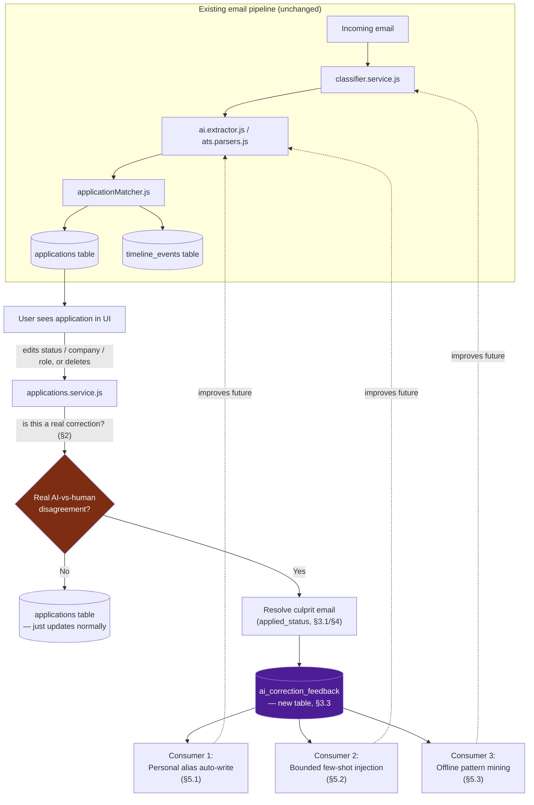
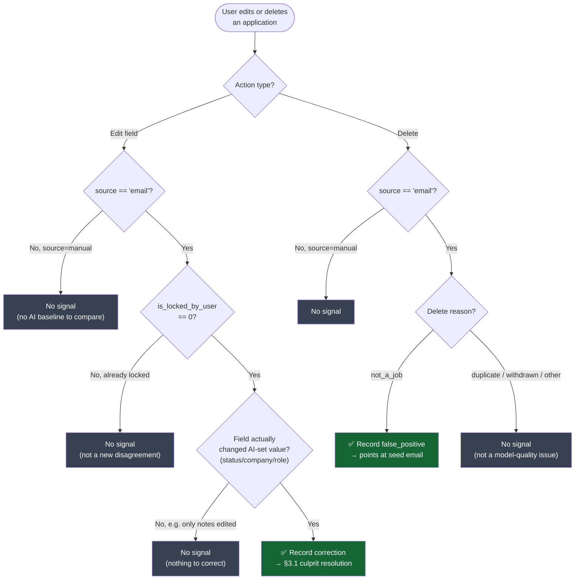
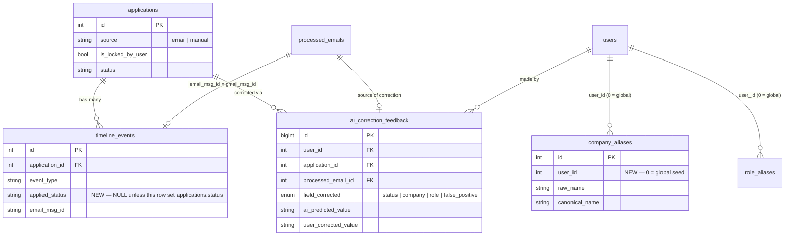
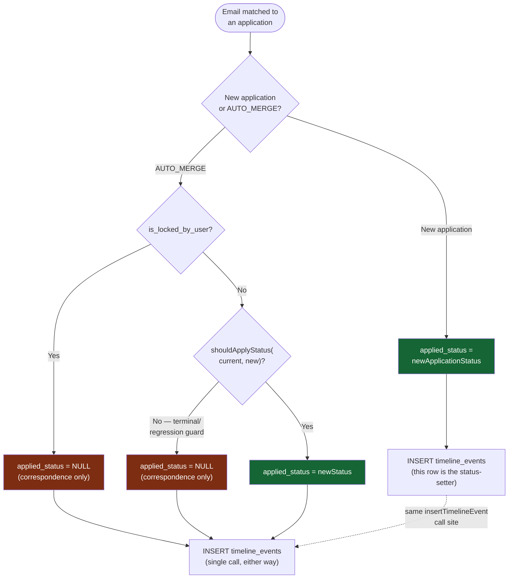
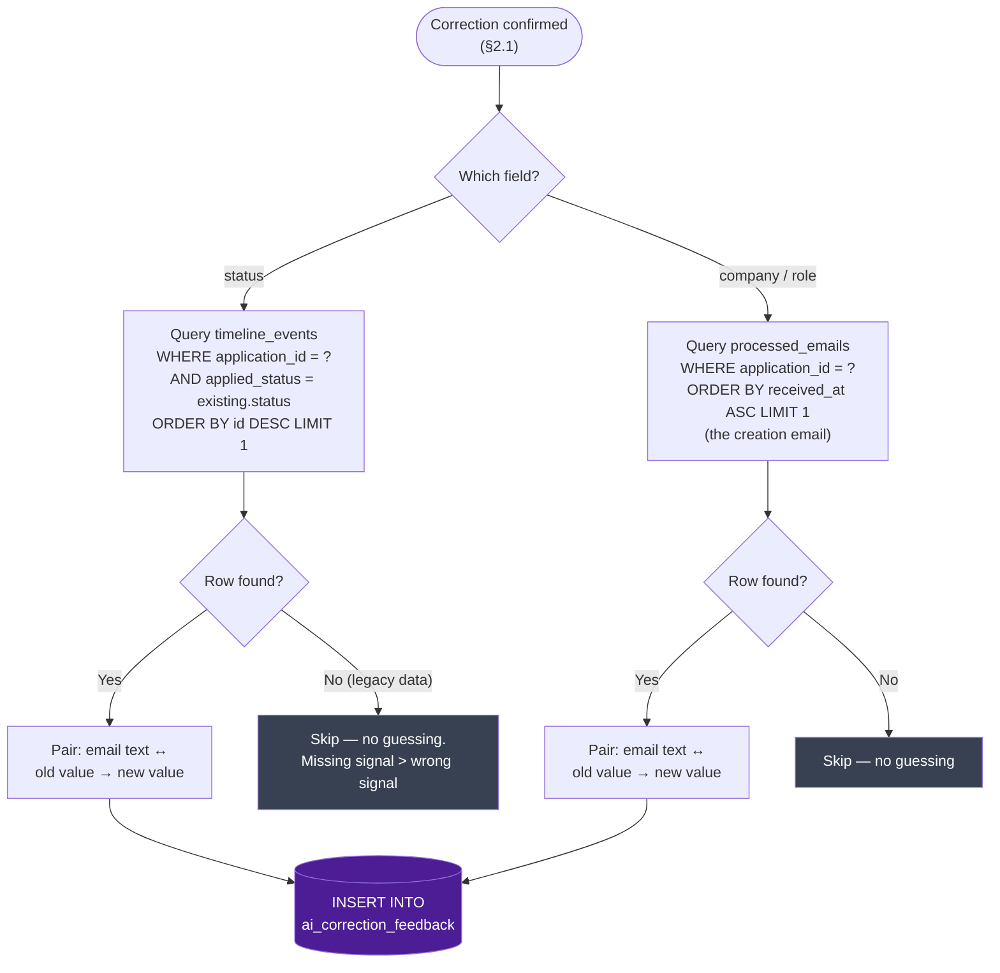

# AI Correction Feedback Loop — Architecture

Status: **Approved design, not yet implemented.**
Reviewed by: primary design + second-developer review + cross-check against live code (2026-09).

## 1. Problem

The email pipeline (`classifier.service.js` → `ai.extractor.js` / `ats.parsers.js` → `applicationMatcher.js`) sometimes gets it wrong — e.g. an actual "Offer" email gets classified/extracted as "Rejected". Today, when a user manually corrects that in the UI, the correction only updates that one row (`applications.status` flips, `is_locked_by_user` locks it). The fact that the AI was wrong — and specifically *which email* it was wrong about — is thrown away. Nothing downstream gets smarter.

**Goal**: turn every real user correction into a structured, reusable signal that improves future classification/extraction — without retraining a model, without polluting other users' data, and without silently mislabeling the wrong email as the culprit.

### 1.1 System overview



The loop closes back into the same pipeline that produced the original mistake — nothing here is a parallel system.

## 2. What counts as a correction (and what doesn't)

Only some user edits are real "AI was wrong" signals:

| User action | Signal? | Why |
|---|---|---|
| Edits an `source='email'` application's AI-set field (status/company/role) while `is_locked_by_user = 0` | **Yes** | First human override of something the AI actually decided |
| Edits an already-locked application again | No | Not a new "AI vs human" disagreement — AI's decision was already overridden once |
| Creates a `source='manual'` application from scratch | No | No AI baseline exists to compare against |
| Edits fields the AI never set (notes, platform on a manual entry) | No | Nothing to correct |
| Deletes a `source='email'` application with reason `not_a_job` | **Yes** | Classifier-level false positive — the email should never have created an application |
| Deletes for any other reason (duplicate, withdrawn, declutter) | No | Not a model-quality signal |

### 2.1 Trigger decision flowchart



## 3. Data model

### 3.0 Schema relationships



### 3.1 `timeline_events.applied_status` (new column)

**The critical piece.** Needed to correctly identify *which specific email* set the status value the user is now correcting — not just "the most recent email on this application."

**Why timestamp-based attribution is wrong**: an application can receive a *correspondence-only* email after the status-setting one (e.g. a candidate-experience survey after a rejection, or any email blocked by the terminal-status guard in `shouldApplyStatus`). That later email still gets written to `timeline_events` (Phase 4 fix: timeline writing is decoupled from the status-progression guard), but never changed `applications.status`. Naively picking "most recent `timeline_events` row" as the culprit would pair the correction with the wrong email's text — silently training on a bad (input, label) pair.

**Fix**: add a structured column instead of parsing free-text `description`:

```sql
ALTER TABLE timeline_events
  ADD COLUMN applied_status VARCHAR(50) NULL DEFAULT NULL AFTER event_type,
  ADD INDEX idx_timeline_app_status (application_id, applied_status);
```

Populated in `pipeline.orchestrator.js`:
- New application (first event): `applied_status = newApplicationStatus` (the status the row was created with).
- `AUTO_MERGE`, unlocked, `shouldApplyStatus(...)` true: `applied_status = newStatus` (the value actually written to `applications.status`).
- `AUTO_MERGE`, locked, or blocked by the terminal/regression guard: `applied_status = NULL` — this row is correspondence only, never a status-setter.

Implementation note: `isLocked` and the `shouldApplyStatus(...)` result already get computed in this function — they just need to be computed *before* the single `insertTimelineEvent` call (currently they're computed after) so the same boolean can decide both `applied_status` and the branch logic that follows. No duplicate insert paths needed.

**`applied_status` population — decision flow inside `processEmail()`:**



This is the exact mechanism that prevents the failure mode from §1: a correspondence-only email (survey, follow-up after a terminal status) always gets `applied_status = NULL`, so it can never be mistaken for the email that actually set "Rejected"/"Offer"/etc.

Not stored in the existing `metadata JSON` column on the same table: the culprit query needs an exact-match, indexable `WHERE applied_status = ?`, which JSON columns can't do without a generated/virtual column — same migration cost as just adding a real column, so a real column is simpler.

### 3.2 Multi-tenant alias isolation

**Problem with the naive version of this design**: `company_aliases`/`role_aliases` (`migrations/add_alias_tables.sql`) are global tables with no `user_id`, unique on `raw_name`/`raw_title`. Auto-writing a user's correction directly into them would let one user's bad edit (typo, wrong company) corrupt matching for every other user.

**Fix** — scoped aliases with a safe global fallback:

```sql
ALTER TABLE company_aliases
  ADD COLUMN user_id INT NOT NULL DEFAULT 0 AFTER id,
  DROP INDEX uq_company_raw_name,
  ADD UNIQUE KEY uq_company_user_raw (user_id, raw_name),
  ADD INDEX idx_company_lookup (raw_name, user_id);

ALTER TABLE role_aliases
  ADD COLUMN user_id INT NOT NULL DEFAULT 0 AFTER id,
  DROP INDEX uq_role_raw_title,
  ADD UNIQUE KEY uq_role_user_raw (user_id, raw_title),
  ADD INDEX idx_role_lookup (raw_title, user_id);
```

`user_id = 0` means global/seed (all existing rows backfill to this). `user_id > 0` means one user's personal correction. **Why not a nullable `user_id`**: MySQL/InnoDB treats every `NULL` as distinct under a `UNIQUE` constraint, so `UNIQUE(user_id, raw_name)` would *not* prevent duplicate `(NULL, 'Google')` rows. `DEFAULT 0` sidesteps this entirely.

Lookup (replaces the current unscoped query in `normalization.service.js`):
```sql
SELECT canonical_name FROM company_aliases
WHERE user_id IN (?, 0) AND raw_name = ?
ORDER BY user_id DESC LIMIT 1;
```
User-specific row wins if present (`user_id > 0` sorts before `0` in `DESC`), otherwise falls back to the global seed.

**Deliberately deferred to a later iteration**: automated "promote to global after N users agree" consensus logic. Not worth building before there's correction volume to justify it — a human can promote a correction to the global table by hand once `ai_correction_feedback` shows the same fix recurring across users. Revisit only if that manual step becomes a bottleneck.

### 3.3 `ai_correction_feedback` (new table)

```sql
CREATE TABLE IF NOT EXISTS ai_correction_feedback (
  id BIGINT AUTO_INCREMENT PRIMARY KEY,
  user_id INT NOT NULL,
  application_id INT NOT NULL,
  processed_email_id INT NULL,

  field_corrected ENUM('status', 'company', 'role', 'false_positive') NOT NULL,
  ai_predicted_value VARCHAR(255) NULL,
  user_corrected_value VARCHAR(255) NULL,

  -- Denormalized snapshot: survives processed_email_id being nulled out if
  -- the source email row is later deleted/rotated; avoids a join on the
  -- heavy processed_emails table for admin/export queries.
  sender_domain VARCHAR(255) NULL,
  email_subject VARCHAR(500) NULL,
  ai_classification VARCHAR(100) NULL,
  ai_confidence DECIMAL(5,2) NULL,

  is_reviewed TINYINT(1) NOT NULL DEFAULT 0,
  created_at TIMESTAMP DEFAULT CURRENT_TIMESTAMP,

  INDEX idx_user_field (user_id, field_corrected),
  INDEX idx_domain_field (sender_domain, field_corrected),
  INDEX idx_created (created_at),
  FOREIGN KEY (user_id) REFERENCES users(id) ON DELETE CASCADE,
  FOREIGN KEY (application_id) REFERENCES applications(id) ON DELETE CASCADE,
  FOREIGN KEY (processed_email_id) REFERENCES processed_emails(id) ON DELETE SET NULL
);
```

Note: `applications` uses soft delete (`deleted_at`) everywhere else in this codebase, so the `ON DELETE CASCADE` to `applications` is defensive but not expected to fire in normal operation.

## 4. Trigger & attribution rules

A feedback row is written only when **all** hold:
- `application.source === 'email'`
- `application.is_locked_by_user === 0` (this is the *first* human override)
- The incoming value actually differs from the existing one

**Culprit-email resolution** (uses `applied_status`, not timestamps):

```sql
-- For a status correction:
SELECT te.email_msg_id, pe.id AS processed_email_id, pe.sender_domain,
       pe.subject, pe.classification, pe.confidence
FROM timeline_events te
JOIN processed_emails pe ON pe.gmail_msg_id = te.email_msg_id AND pe.user_id = ?
WHERE te.application_id = ? AND te.applied_status = ?  -- exact match on existing.status
ORDER BY te.id DESC
LIMIT 1;
```

- **Status corrections** → the timeline row whose `applied_status` equals the value being corrected (e.g. `'Rejected'`). Correspondence-only rows (`applied_status IS NULL`) are structurally invisible to this query — no guessing.
- **Company/role corrections** → the *first* email that created the application (`ORDER BY received_at ASC LIMIT 1` on `processed_emails`), since that's what originally produced the wrong entity value.
- **If no row matches** (legacy data predating this migration, or an already-locked edit) → skip silently. Never record a guessed/uncertain pairing — a missing training signal is better than a wrong one.

**Deletion**: `deleteApplication` accepts an optional `reason: 'not_a_job' | 'duplicate' | 'withdrawn' | 'other'`. Only `reason === 'not_a_job'` on a `source === 'email'` application emits `field_corrected = 'false_positive'`, pointing at the seed email.

### 4.1 Culprit-email resolution flowchart



## 5. Downstream consumers

1. **Personal alias auto-write (instant, safe)** — on a company/role correction, upsert into `company_aliases`/`role_aliases` with the correcting user's `user_id`. Future emails for that user normalize correctly immediately, no AI call needed. Other users are fully isolated (§3.2).

2. **Bounded few-shot prompt injection (runtime)** — in the prompt-building step, if prior corrections exist for the email's `sender_domain` **for this specific user**, inject at most 1–2 **structured JSON input/output pairs**. Never freeform natural-language notes, and never a domain-wide rule like "emails from X are always Offer" — a single sender domain legitimately sends confirmations, assessments, interviews, offers, *and* rejections, so a blanket rule would misclassify the next real rejection from the same company. (Earlier drafts of this design called the risk here "prompt injection" — more precisely it's **extraction-quality degradation from context pollution**, since the model's output is strictly parsed JSON with no execution path, not an exploitable instruction-override.)

3. **Offline deterministic-parser mining** — periodically cluster corrections to find patterns worth hand-coding as zero-token rules:
   ```sql
   SELECT sender_domain, field_corrected, ai_predicted_value, user_corrected_value, COUNT(*) AS frequency
   FROM ai_correction_feedback
   GROUP BY sender_domain, field_corrected, ai_predicted_value, user_corrected_value
   HAVING frequency >= 3
   ORDER BY frequency DESC;
   ```
   High-frequency clusters feed directly into `ats.parsers.js` (deterministic, zero-token) and `classifier.service.js`'s keyword/rule lists — the same evidence-driven pattern already used to build those files from real incidents, just now backed by structured data instead of manual log-reading.

## 6. Explicitly out of scope for v1

- Automated cross-user alias consensus/promotion — manual review instead, until volume justifies automation.
- Per-user or global model fine-tuning — cost/complexity not justified at current scale; few-shot injection + alias tables + deterministic parser growth capture most of the value far more cheaply.
- Auto-flipping AI decisions in real time off a single correction — one example is not enough signal; avoids overfitting to an n=1 case.

## 7. Rollout order

1. Migration: `timeline_events.applied_status` + index.
2. `pipeline.orchestrator.js`: reorder `isLocked`/`shouldApplyStatus` computation ahead of the existing single `insertTimelineEvent` call; thread `applied_status` through (merge path + new-application path).
3. Migration: `company_aliases`/`role_aliases` → add `user_id`, rekey uniqueness; update `normalization.service.js` lookup to the scoped query.
4. Migration: `ai_correction_feedback` table.
5. `applications.service.js`: diff-detection + feedback-row insert in `updateManualApplication`; reason-gated insert in `deleteApplication`.
6. Consumer 1 (alias auto-write) — wire into the same service functions from step 5.
7. Consumer 2 (few-shot injection) — prompt-builder change.
8. Consumer 3 (clustering query) — admin/reporting only, no pipeline change; can ship whenever there's enough data to be useful.

## 8. Review trail

This design went through three passes before being considered ready:
1. Initial proposal (correction → training signal, few-shot injection, alias auto-write).
2. Second-developer review caught: alias tables have no multi-tenancy (critical), sender-domain-wide status rules would degrade accuracy, deletion needed an explicit reason, "prompt injection" was the wrong threat model for what's actually context pollution.
3. Final gap found during cross-check: timestamp-based culprit-email attribution is wrong whenever a correspondence-only email arrives after the real status-setting one — fixed with the `applied_status` column, verified against the current (Phase 3/4-restructured) `pipeline.orchestrator.js` rather than assumed from an earlier version of the file.
